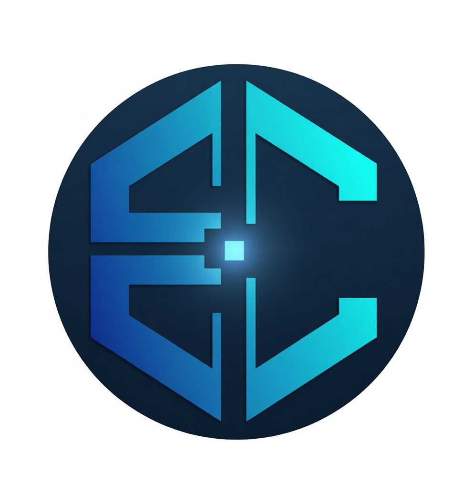

# Sobre mim

##  Olá, sou **Edgardo Correa**

Sou formado em **Sistemas de Informação** e apaixonado por tecnologia, aprendizado contínuo e por resolver problemas de forma prática e eficiente. Tenho grande interesse pelas áreas de **Suporte Técnico, Infraestrutura, Redes e Service Desk**, sempre mantendo uma mentalidade positiva, focada em resultados e na experiência do usuário.

Ao longo da minha trajetória, desenvolvi uma abordagem otimista: acredito que tudo tem solução e que cada desafio é uma oportunidade para evoluir. Tenho facilidade em criar conexões, trabalhar em equipe e trazer leveza aos ambientes em que estou — tanto profissionais quanto pessoais.

Estou plenamente apto a assumir novas funções e aberto a processos de recolocação que estejam alinhados às minhas competências e objetivos profissionais. Busco oportunidades que me permitam aplicar minhas habilidades e expandir meus conhecimentos.

##  Meus interesses
- Tecnologia e soluções digitais
- Atendimento ao cliente e suporte técnico
- Infraestrutura, redes e sistemas
- Aprender novas ferramentas e metodologias
- Conversas que fazem pensar
- Animes, vídeos e conteúdos reflexivos

## ️ Tecnologias e Ferramentas
- **Windows Server**, **Active Directory**
- **VPN**, **Protocolos de Rede**, **Cabeamento Estruturado**
- **Service Desk**, **Atendimento ao Cliente**, **Jira**
- Ferramentas de IA: **ChatGPT**, **Claude**

##  Mentalidade e Valores
- Otimismo e foco em resultados
- Empatia e vontade genuína de ajudar
- Aprendizado contínuo
- Boa comunicação e construção de boas relações

##  Tema do Portfólio
Este perfil segue meu estilo visual preferido: **neon**, com destaque para tons de **azul**, **preto** e **branco**, inspirado no visual do meu portfólio.

##  Contato
Sinta-se à vontade para entrar em contato ou explorar meus projetos. Obrigado por visitar meu GitHub!
